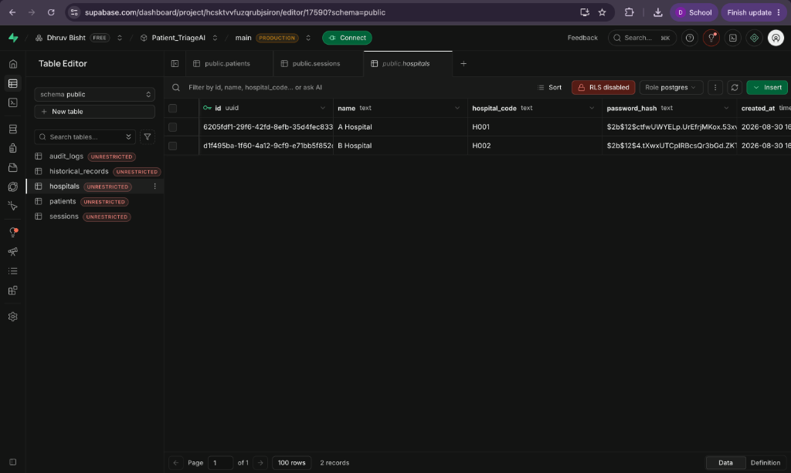

# PatientTriage.ai

**Hybrid AI-Powered Emergency Department Triage System**

PatientTriage.ai is an intelligent, multi-tenant patient triage system designed for hospital emergency departments. It combines a strict **deterministic rules engine** (to guarantee patient safety) with a **Machine Learning advisory layer** (to spot subtle deterioration patterns), ensuring no patient is ever under-triaged while giving clinicians AI-powered decision support.

---

## Table of Contents

- [Key Features](#-key-features)
- [Architecture Overview](#-architecture-overview)
- [Getting Started](#-getting-started)
- [Section 1 — Triage Dashboard](#-section-1--triage-dashboard-clinician--receptionist-portal)
- [Section 2 — Hospital Admin Portal & FHIR API](#-section-2--hospital-admin-portal--fhir-api)
- [Section 3 — Supabase Database Architecture](#-section-3--supabase-database-architecture)
- [API Reference](#-api-reference)
- [Documentation](#-documentation)

---

## ✨ Key Features

| Feature | Description |
|---|---|
| **Hybrid Triage Engine** | Deterministic age-stratified rules + ML severity prediction. The reconciler enforces safety invariants — ML can escalate, but **never** downgrade below rules. |
| **NLP Chatbot (Rhea)** | Clinicians type natural language (e.g. *"Patient has HR 120 and Temp 39"*) and vitals are auto-extracted and structured. |
| **FHIR Interoperability** | Hospital admins can ingest historical patient records via standard FHIR Bundles, parsed using LOINC codes. |
| **Surge Simulation** | Simulates a 3× patient influx and halves wait-time SLA thresholds to model ER capacity strain. |
| **Deterioration Modeling** | Simulates patients worsening while waiting — auto-triggers re-triage and priority escalation. |
| **Role-Based Access (RBAC)** | Clinicians see full clinical data. Receptionists see scrubbed vitals. PII is masked for other roles. |
| **Multi-Tenancy** | Multiple hospitals share the same infrastructure with complete data isolation via hospital codes. |
| **Real-time Audit Trail** | Comprehensive logging of every triage decision, ML disagreement, clinician override, and deterioration event. |

---

## 🏗 Architecture Overview

```
┌──────────────────────────────────────────────────────────────────┐
│                       FRONTEND LAYER                            │
│   login.html → index.html (Triage Dashboard)                   │
│   hospital_portal.html (Admin Portal)                          │
│   Vanilla HTML / JS / CSS served by FastAPI                    │
├──────────────────────────────────────────────────────────────────┤
│                       BACKEND (FastAPI)                         │
│                                                                  │
│  ┌──────────┐  ┌────────────┐  ┌──────────┐  ┌──────────────┐  │
│  │ Auth &   │  │  Triage    │  │   FHIR   │  │  Simulation  │  │
│  │ RBAC     │  │  Engine    │  │  Parser  │  │  Engine      │  │
│  └──────────┘  └────────────┘  └──────────┘  └──────────────┘  │
│       │              │               │               │          │
│       │        ┌─────┴─────┐         │               │          │
│       │        │           │         │               │          │
│       │   ┌────┴───┐  ┌───┴────┐    │    ┌──────────┴────┐    │
│       │   │ Rules  │  │   ML   │    │    │ Surge + Deter │    │
│       │   │ Engine │  │ Model  │    │    │ Simulation    │    │
│       │   └────┬───┘  └───┬────┘    │    └───────────────┘    │
│       │        └─────┬─────┘         │                         │
│       │          Reconciler          │                         │
│       │      (Safety Invariant)      │                         │
├──────────────────────────────────────────────────────────────────┤
│                    SUPABASE (PostgreSQL)                         │
│  sessions │ patients │ hospitals │ historical_records │ audit   │
└──────────────────────────────────────────────────────────────────┘
```

- **Backend**: FastAPI (Python) REST API
- **Frontend**: Vanilla HTML/JS/CSS — interactive queue, AI chatbot (Rhea)
- **ML Model**: `scikit-learn` GradientBoostingClassifier running locally
- **Database**: Supabase (PostgreSQL) for real-time patient data, multi-tenant hospital configs, and historical records

---

## 🚀 Getting Started

### Prerequisites

- Python 3.9+
- A [Supabase](https://supabase.com) project (free tier works)
- Git

### 1. Clone the Repository

```bash
git clone https://github.com/ShadowHey/Accenture_Challenge.git
cd Accenture_Challenge
```

### 2. Create a Virtual Environment

```bash
python3 -m venv venv
source venv/bin/activate        # macOS / Linux
# venv\Scripts\activate         # Windows
pip install -r requirements.txt
```

### 3. Configure Environment Variables

Copy the example environment file and add your Supabase credentials:

```bash
cp .env.example .env
```

Open `.env` and fill in:
```env
SUPABASE_URL=https://your-project.supabase.co
SUPABASE_KEY=your_supabase_service_role_key
```

> **Where to find these:** In your Supabase dashboard → **Settings** → **API**. Use the `service_role` key (not the `anon` key).

### 4. Initialize the Database

Run the SQL migration in your Supabase SQL Editor (**SQL Editor** → **New Query** → paste and run):

```sql
-- Create Hospitals Table
CREATE TABLE IF NOT EXISTS hospitals (
    id UUID PRIMARY KEY DEFAULT uuid_generate_v4(),
    name TEXT NOT NULL,
    hospital_code TEXT UNIQUE NOT NULL,
    password_hash TEXT NOT NULL,
    created_at TIMESTAMP WITH TIME ZONE DEFAULT NOW()
);

-- Create Historical Records Table
CREATE TABLE IF NOT EXISTS historical_records (
    id UUID PRIMARY KEY DEFAULT uuid_generate_v4(),
    hospital_id UUID REFERENCES hospitals(id),
    patient_name TEXT,
    age INTEGER,
    gender TEXT,
    chief_complaint TEXT,
    vitals JSONB,
    medical_history JSONB,
    observed_signs JSONB,
    visit_date TEXT,
    discharge_status TEXT,
    raw_data JSONB,
    created_at TIMESTAMP WITH TIME ZONE DEFAULT NOW()
);

-- Create Sessions Table
CREATE TABLE IF NOT EXISTS sessions (
    id UUID PRIMARY KEY DEFAULT uuid_generate_v4(),
    status TEXT DEFAULT 'active',
    closed_at TIMESTAMP WITH TIME ZONE,
    created_at TIMESTAMP WITH TIME ZONE DEFAULT NOW()
);

-- Create Patients Table (real-time queue)
CREATE TABLE IF NOT EXISTS patients (
    id TEXT NOT NULL,
    session_id UUID REFERENCES sessions(id),
    hospital_code TEXT,
    name TEXT,
    priority TEXT,
    vitals JSONB,
    triage_result JSONB,
    patient_data JSONB,
    added_at FLOAT,
    queue_order FLOAT,
    reassessment_required BOOLEAN DEFAULT FALSE,
    escalation_required BOOLEAN DEFAULT FALSE,
    reassessment_count INTEGER DEFAULT 0,
    wait_status TEXT DEFAULT 'WITHIN_SLA',
    completed_at FLOAT,
    archived BOOLEAN DEFAULT FALSE,
    PRIMARY KEY (id, session_id)
);
```

Then, seed the default hospitals by running this Python script:

```bash
python fix_db.py
```

> This inserts Hospital A (`H001`) and Hospital B (`H002`) with their bcrypt-hashed passwords into Supabase.

### 5. Train the ML Model (Optional)

Generate synthetic training data and train the local ML model:

```bash
python -m backend.ml.training.generate_training_data
python -m backend.ml.training.train_model
```

> The system works without the ML model — it falls back to the deterministic rules engine only.

### 6. Start the Server

```bash
uvicorn backend.main:app --reload
```

The application is now live at: **http://127.0.0.1:8000**

---

## 🏥 Section 1 — Triage Dashboard (Clinician & Receptionist Portal)

**URL:** `http://127.0.0.1:8000/login.html` → redirects to `http://127.0.0.1:8000/index.html`

This is the primary interface used by emergency department staff to triage incoming patients in real-time.

### Login Credentials

| Hospital | Role | Username | Password |
|----------|------|----------|----------|
| Hospital A (H001) | **Clinician** | `clinician@H001.hosp` | `clinician123` |
| Hospital A (H001) | **Receptionist** | `receptionist@H001.hosp` | `reception123` |
| Hospital B (H002) | **Clinician** | `clinician@H002.hosp` | `clinician123` |
| Hospital B (H002) | **Receptionist** | `receptionist@H002.hosp` | `reception123` |

### What You Can Do

1. **Add Patients** — Use the "Add Patient" form to enter demographics, vitals, chief complaint, and medical history. The system auto-generates a unique Patient ID and runs the full triage pipeline.

2. **Real-time Priority Queue** — Patients are displayed in a live, sorted queue by severity level (LEVEL 1 being the most critical). Each card shows the assigned priority, confidence score, ML source, and wait-time SLA status.

3. **NLP Chatbot (Rhea)** — Click the chat icon and type natural language like:
   > *"45 year old male, chest pain, heart rate 120, BP 150/90, SpO2 94"*
   
   The NLP engine extracts structured vitals automatically and updates the patient record.

4. **Clinician Override** — Clinicians can manually override the AI's triage decision with a reason. Overrides are fully audit-logged.

5. **Surge Simulation** — Trigger a 3× patient surge to test how the system handles mass-casualty scenarios. Wait-time SLA thresholds are halved during surge mode.

6. **Deterioration Simulation** — Simulate patients' vitals worsening over time. The system auto-detects deterioration and re-triages affected patients to higher priority levels.

7. **Discharge & Archive** — Move patients through the full lifecycle: Queue → Discharged → Archived.

8. **Audit Logs** — View a complete timeline of every triage decision, ML-Rules disagreement, clinician override, surge event, and deterioration escalation.

### Role Differences

| Feature | Clinician | Receptionist |
|---------|-----------|--------------|
| View patient queue | ✅ Full details | ✅ Scrubbed vitals |
| View ML confidence & reasons | ✅ | ❌ Hidden |
| Override triage priority | ✅ | ❌ Locked |
| Update vitals | ✅ | ❌ |
| Add patients | ✅ | ✅ |
| Discharge patients | ✅ | ✅ |

---

## 🏢 Section 2 — Hospital Admin Portal & FHIR API

**URL:** `http://127.0.0.1:8000/hospitals`

This is the administration portal for hospital-level operations — primarily used to **ingest historical medical data** in the industry-standard **FHIR (Fast Healthcare Interoperability Resources)** format.

### Login Credentials

| Hospital | Hospital Code | Password |
|----------|---------------|----------|
| Hospital A | `H001` | `A001` |
| Hospital B | `H002` | `B002` |

### What You Can Do

1. **Login / Register** — Existing hospitals log in with their hospital code. New hospitals can self-register.

2. **Submit Historical FHIR Data** — After logging in, paste a standard FHIR Bundle JSON into the text area and submit. The system parses the bundle, extracts patient demographics, vitals (using LOINC codes), and medical history (from Condition resources), and stores them in the `historical_records` table in Supabase.

### FHIR API Endpoint

**`POST /api/fhir/historical`**

This endpoint accepts an authenticated request with a FHIR Bundle and stores the parsed data as a historical record linked to the authenticated hospital.

**Headers:**
```
Content-Type: application/json
Authorization: Bearer <your_session_token>
```

**Example FHIR Bundle Payload:**
```json
{
  "resourceType": "Bundle",
  "type": "collection",
  "entry": [
    {
      "resource": {
        "resourceType": "Patient",
        "id": "patient-001",
        "name": [{ "given": ["Rahul"], "family": "Sharma" }],
        "gender": "male",
        "birthDate": "1985-03-15"
      }
    },
    {
      "resource": {
        "resourceType": "Observation",
        "code": {
          "coding": [{ "system": "http://loinc.org", "code": "8867-4", "display": "Heart rate" }]
        },
        "valueQuantity": { "value": 110, "unit": "bpm" }
      }
    },
    {
      "resource": {
        "resourceType": "Observation",
        "code": {
          "coding": [{ "system": "http://loinc.org", "code": "8310-5", "display": "Body temperature" }]
        },
        "valueQuantity": { "value": 38.5, "unit": "°C" }
      }
    },
    {
      "resource": {
        "resourceType": "Observation",
        "code": {
          "coding": [{ "system": "http://loinc.org", "code": "2708-6", "display": "SpO2" }]
        },
        "valueQuantity": { "value": 96, "unit": "%" }
      }
    },
    {
      "resource": {
        "resourceType": "Observation",
        "code": {
          "coding": [{ "system": "http://loinc.org", "code": "85354-9", "display": "Blood pressure" }]
        },
        "component": [
          {
            "code": { "coding": [{ "code": "8480-6" }] },
            "valueQuantity": { "value": 140, "unit": "mmHg" }
          },
          {
            "code": { "coding": [{ "code": "8462-4" }] },
            "valueQuantity": { "value": 90, "unit": "mmHg" }
          }
        ]
      }
    },
    {
      "resource": {
        "resourceType": "Condition",
        "code": {
          "coding": [{ "display": "Type 2 Diabetes Mellitus" }],
          "text": "Type 2 Diabetes Mellitus"
        },
        "clinicalStatus": {
          "coding": [{ "code": "resolved" }]
        }
      }
    },
    {
      "resource": {
        "resourceType": "Condition",
        "code": {
          "coding": [{ "display": "Acute Chest Pain" }],
          "text": "Acute Chest Pain"
        },
        "clinicalStatus": {
          "coding": [{ "code": "active" }]
        }
      }
    }
  ]
}
```

### Supported LOINC Codes

The FHIR parser maps these standard LOINC codes to internal vitals fields:

| LOINC Code | Vital Sign | Internal Field |
|------------|------------|----------------|
| `8867-4` | Heart Rate | `heart_rate` |
| `2708-6` | SpO2 | `spo2` |
| `8310-5` | Body Temperature | `temperature` |
| `9279-1` | Respiratory Rate | `respiratory_rate` |
| `72514-3` | Pain Scale | `pain_scale` |
| `85354-9` | Blood Pressure (Panel) | `blood_pressure` |
| `8480-6` | Systolic BP (component) | parsed from BP panel |
| `8462-4` | Diastolic BP (component) | parsed from BP panel |

### Additional FHIR Endpoint (Live Triage)

**`POST /api/fhir/Bundle`** — Ingests a FHIR Bundle and directly adds the patient to the live triage queue (instead of storing as historical data). Useful for EHR integrations that push patients in real-time.

---

## 🗄 Section 3 — Supabase Database Architecture

The entire backend is powered by **Supabase (PostgreSQL)**. Below is a screenshot of the production database showing the five core tables:



### Table Descriptions

| Table | Purpose |
|-------|---------|
| **`sessions`** | Tracks application lifecycle. A new session is created each time the server starts, and closed on shutdown. All patient data is scoped to a session. |
| **`patients`** | The **live triage queue**. Stores every patient currently in the ED — their demographics, vitals, triage results (rules + ML), priority level, wait-time SLA status, and queue ordering. Data is scoped by `session_id` and `hospital_code` for multi-tenancy. |
| **`hospitals`** | Multi-tenant hospital registry. Stores hospital names, unique codes, and bcrypt-hashed passwords. Each hospital's staff and patients are isolated by their `hospital_code`. |
| **`historical_records`** | Stores parsed FHIR Bundle data uploaded by hospital admins. Linked to the `hospitals` table via `hospital_id`. Contains patient demographics, vitals (JSONB), medical history (JSONB), and the raw FHIR payload for auditability. |
| **`audit_logs`** | Comprehensive event log covering triage decisions, clinician overrides, ML-Rules disagreements, surge events, deterioration alerts, and discharge records. |

### Data Flow

```
Hospital Admin uploads FHIR Bundle
       │
       ▼
  /api/fhir/historical ──→ historical_records table
                                    │
                                    ▼
                          ML model trains on this
                          historical data to improve
                          future triage predictions


Clinician adds patient via Dashboard
       │
       ▼
  /api/patient ──→ Rules Engine + ML Model
       │                    │
       │              Reconciler (safety floor)
       │                    │
       ▼                    ▼
  patients table ◄── triage_result stored
       │
       ▼
  Live queue displayed on Dashboard
       │
       ▼
  Discharge ──→ completed_at set ──→ Archive
```

---

## 📡 API Reference

### Authentication
| Method | Endpoint | Description |
|--------|----------|-------------|
| `POST` | `/api/auth/login` | Login (staff or hospital admin) |
| `POST` | `/api/auth/register` | Register a new hospital |
| `POST` | `/api/auth/logout` | Invalidate session token |
| `GET` | `/api/auth/me` | Get current user info |

### Patient Triage
| Method | Endpoint | Description |
|--------|----------|-------------|
| `POST` | `/api/patient` | Add patient via form (auto-generates ID) |
| `POST` | `/api/triage` | Submit patient for triage (raw JSON) |
| `GET` | `/api/queue` | Get priority-sorted patient queue |
| `GET` | `/api/completed` | Get discharged patients |
| `PATCH` | `/api/queue/{id}/update` | Update patient details + re-triage |
| `POST` | `/api/queue/vitals` | Update vitals (triggers escalation check) |
| `POST` | `/api/queue/{id}/discharge` | Discharge a patient |
| `POST` | `/api/completed/{id}/archive` | Archive a completed patient |
| `POST` | `/api/override` | Clinician priority override |

### FHIR Integration
| Method | Endpoint | Description |
|--------|----------|-------------|
| `POST` | `/api/fhir/historical` | Store historical FHIR data (admin portal) |
| `POST` | `/api/fhir/Bundle` | Ingest FHIR Bundle into live queue |

### NLP Chatbot
| Method | Endpoint | Description |
|--------|----------|-------------|
| `POST` | `/api/chat/extract_vitals` | Extract vitals from natural language |
| `GET` | `/api/chat/patients?name=` | Search patients by name |

### Simulation
| Method | Endpoint | Description |
|--------|----------|-------------|
| `POST` | `/api/surge/start` | Activate 3× surge mode |
| `POST` | `/api/surge/stop` | Deactivate surge mode |
| `POST` | `/api/simulate/deteriorate` | Simulate patient deterioration |

### System
| Method | Endpoint | Description |
|--------|----------|-------------|
| `GET` | `/api/stats` | Dashboard statistics |
| `GET` | `/api/audit` | Audit event log |
| `GET` | `/api/config/profiles` | Hospital configuration profiles |
| `POST` | `/api/config/profile/{id}` | Set active hospital profile |
| `POST` | `/api/clear` | Reset queue and audit state |

---

## 📚 Documentation

| Document | Description |
|----------|-------------|
| `docs/stage1/` | Original High-Level Design (HLD) and Low-Level Design (LLD) from Stage 1 |
| `docs/stage2/` | Updated HLD, LLD, Architecture invariants, ML Training, and Architectural Decisions |
| `architecture.md` | System architecture and data pipeline diagrams |
| `Conversation.md` | Running log of accomplishments across stages |
| `changes.md` | Granular code-level updates and rationale |

---

**Built for the Accenture Innovation Challenge** — by [ShadowHey](https://github.com/ShadowHey)
